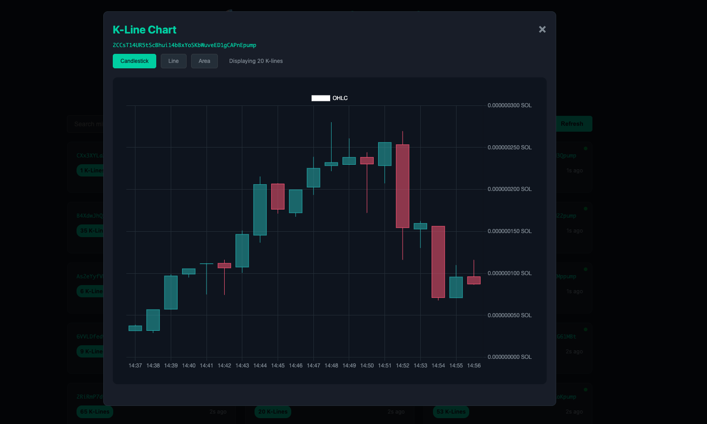

# pump-kmonitor

A real-time K-line monitoring system for Pump.fun tokens with automated strategy detection and notification capabilities.



## Features

- 🔍 **Real-time K-line monitoring**: WebSocket connection to Pump.fun for live trading data
- 📈 **Strategy detection**: Automated pattern recognition for consecutive rising candles
- 🌐 **Web interface**: Interactive dashboard for viewing K-line data and statistics  
- 🔔 **Notification system**: DingTalk integration with customizable alerts
- 💾 **Redis storage**: Efficient data storage and retrieval with automatic cleanup
- 🎯 **Pattern analysis**: Detects 4 consecutive bullish candles with increasing gains

## Quick Start

### Prerequisites

- **Rust** (latest stable version) - [Install Rust](https://rustup.rs/)
- **Redis** server - [Install Redis](https://redis.io/download)

### Installation

1. **Clone the repository:**
```bash
git clone https://github.com/wisarmy/pump-kmonitor.git
cd pump-kmonitor
```

2. **Install dependencies:**
```bash
cargo build --release
```

### Configuration

1. **Copy environment configuration:**
```bash
cp .env.example .env
```

## Commands

### 1. Monitor Command 📊
Start the monitoring service to collect K-line data from Pump.fun WebSocket:

```bash
pump-kmonitor monitor
```

**What it does:**
- Connects to Pump.fun WebSocket endpoint (`https://api.mainnet-beta.solana.com`)s
- Processes real-time trading data and converts to K-line format
- Stores K-line data in Redis with automatic expiration
- Cleans up inactive token data to maintain performance
- Handles connection errors and automatically reconnects

### 2. Web Command 🌐
Start the web service to view K-line data through an interactive dashboard:

```bash
# Start with default port 8080
pump-kmonitor web

# Start with custom port
pump-kmonitor web --port 3000
```

**What it provides:**
- HTTP server with RESTful API endpoints
- Interactive web dashboard for data visualization
- Real-time token statistics and active token list
- K-line charts with candlestick visualization
- System health monitoring

### 3. Strategy Command 🎯
Run automated strategy detection to identify trading patterns:

```bash
# Run once and exit
pump-kmonitor strategy --once

# Run continuously with default 10-second interval
pump-kmonitor strategy

# Run continuously with custom interval (in seconds)
pump-kmonitor strategy --interval 60
```

**What it detects:**
- 4 consecutive bullish candles (close > open)
- Each candle must have increasing percentage gains
- Minimum 1% gain threshold per candle body
- Prevents duplicate notifications for same pattern
- Sends structured alerts via notification script
